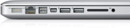
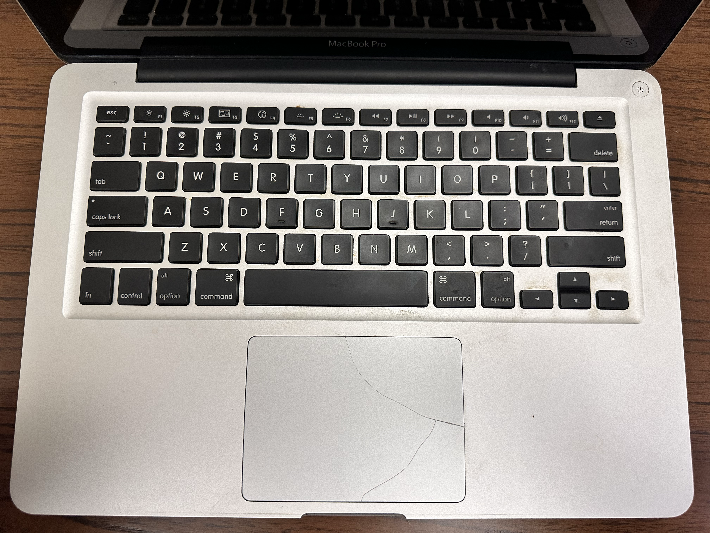
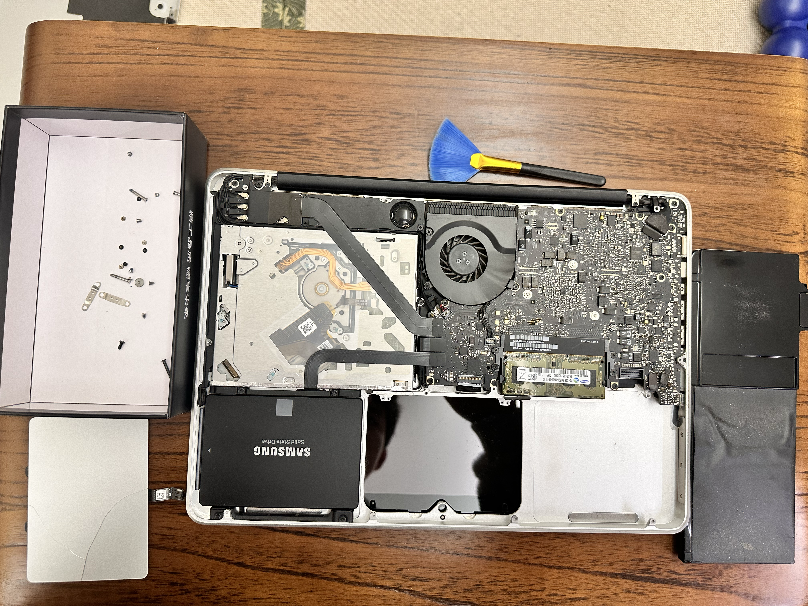
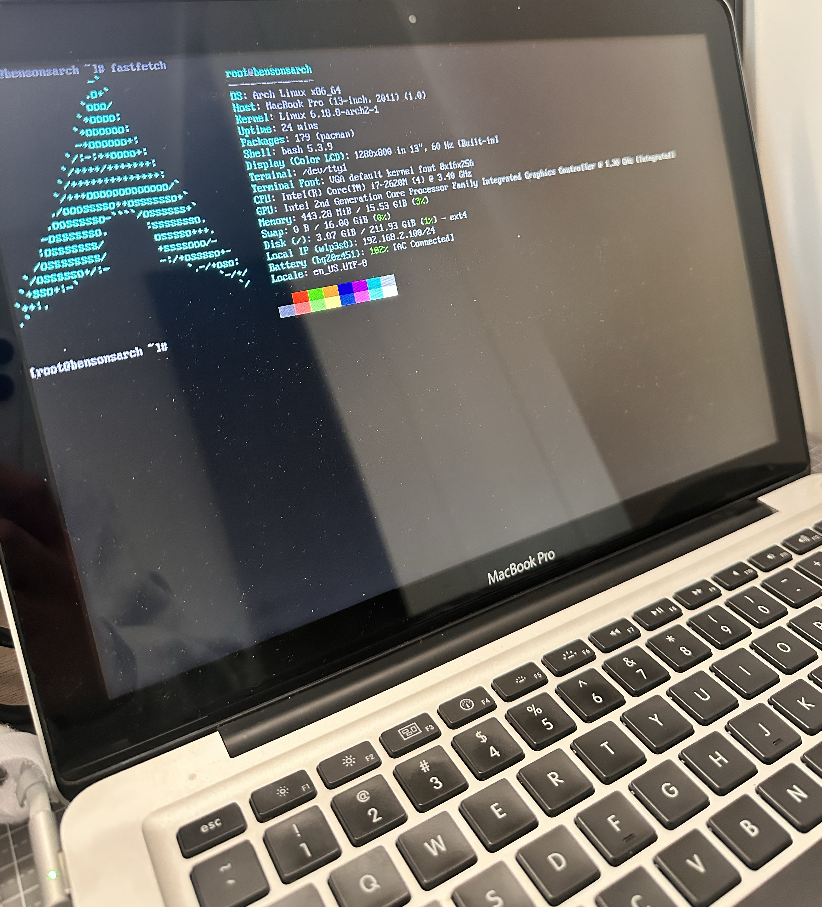

## 📝 故事开头

寒假回家的第一天，我就注意到了这个躺在角落里的破烂Macbook Pro，还记得上次使用它还是2020年疫情期间，用于打印了成堆的课堂作业......以前的我面对这种老破烂可能会嗤之以鼻，但现在我觉得复活这个老家伙是一件非常酷的事情。
这是一台2011年产的Macbook Pro A1278，搭载Intel Core i7处理器，内置4G DDR3内存，250G机械硬盘，自带光驱，具体参数参考[链接](https://support.apple.com/zh-cn/112600)。

再次打开这台笔记本，它的状态是无法点亮、触控板断裂、电池膨胀、一根DDR3内存条损坏、光驱老化无法读盘，参考如下图

{.center}

{.center}

通过简单更换掉原来的鼓包电池和包浆充电器以后，我再一次成功点亮了这位老东西，win7可以在这里2G的DDR3内存上较为卡顿的运行

最后，我为这台笔记本做了整体清灰，升级了**2 * 8G DDR3内存**，更换可用的同型号**光驱、新电池、新触控板**，并安装了一个**Arch Linux**用于个人品味咸淡。在拆解过程中，最可惜的是我的不当操作，将该笔记本的脆弱的摄像头连接线(camera cable)扯断了，导致该设备摄像头无法被调用，总体来看摄像头不影响这个玩具笔记本的使用，也就将就了。

{.center}


## 🏹 Arch Linux

以下是我安装配置Arch Linux的路线，参考[Arch Linux官方安装指南](https://wiki.archlinuxcn.org/wiki/%E5%AE%89%E8%A3%85%E6%8C%87%E5%8D%97)，供个人回顾学习。

> [!note] Arch Linux
> [Arch Linux](https://wiki.archlinuxcn.org/wiki/%E5%AE%89%E8%A3%85%E6%8C%87%E5%8D%97) 被设计为可以运行在配置为最低 512 MiB 内存的 x86_64 架构的计算机上，但如果是从安装介质启动系统并成功安装在计算机硬盘中，则可能需要更多的内存。基本安装方式将占用小于 2 GiB 的**硬盘存储空间**。

### ventoy安装和引导
**ventoy** 是一个非常方便的U盘烧录工具，将 `ventoy2disk` 安装在我的U盘上后，我只需要将arch的iso文件复制到U盘中即可，ventoy支持在我的U盘中保存多个操作系统镜像，使得我的U盘能够制作多个操作系统，这简直比rufus好用太多了，我不用再反复地覆写系统U盘，来重新制作新的系统盘。
在ventoy中选择arch镜像进行安装后，可以选择`normal mode`或`grub2 mode`进行配置，这里需要选择grub2进行引导，因为Arch Linux镜像不支持secure boot，而通过normal mode引导会卡在`not support secure boot`这里.

### 网络配置

`ip`指令用于展示和操作当前计算机中的网络/路由设备，`ip link`指令展示A1278的网络设备如下
- lo: 这是loopback回环设备(127.0.0.1)，每台机器都有可以不用管
- enp2s0f0: 这是有线网卡（以太网），命名规则是
	- en = enthernet
	- p2 = PCI 总线2
	- s0 = 插槽0
	- f0 = 功能0
	- 
因为A1278使用Broadcom无线网卡，Arch Linux安装镜像中默认不带有该无线网卡的驱动，因此当下查不到`wlan`设备，我通过外插一个USB WI-FI适配器可以获得一个临时的无线网卡，并能够被`ip`成功识别。获得Wi-Fi连接能力后，我使用`iwctl`工具连接网络。

> [!note] iwctl
> `iwctl` 是Intel开发的iwd (iNet wireless daemon) 无线守护进程的命令行客户端工具，全称 inet wireless control，用于在linux系统下管理 Wi-Fi 连接。具体使用步骤如[arch wiki](https://wiki.archlinuxcn.org/wiki/Iwd#iwctl)所示。

在进入arch系统后，需要使用`NetworkManager`工具进行网络连接，步骤如下

```bash
# 显示附近可用Wi-Fi
nmcli device wifi list
# 连接到Wi-Fi网络
nmcli device wifi connect _SSID_或_BSSID_ password 密码
```

### 硬盘分区

在进行硬盘分区之前，先学习一下**linux磁盘命名规则**。
> [!note] Linux 磁盘命名规则
>- **SATA/SCSI 机械硬盘**，格式：dev/sd*。
>	- `/dev/sda` 第一块 SATA/SCSI 硬盘，`/dev/sdb` 第二块 SATA/SCSI 硬盘，`/dev/sdc` 第三块硬盘。
>	- `/dev/sda1` sda 的第一个分区，`/dev/sda2` sda 的第二个分区，`/dev/sdb1` sdb 的第一个分区。
>	**sd** 代表 **SCSI Disk**，虽然名字是 SCSI，但现代 SATA 硬盘、USB 存储设备也都用这个命名。
>- **NVMe 固态硬盘：/dev/nvme***，格式：`/dev/nvmeXnY`。
>	- X = 控制器编号（从 0 开始）
>	- n = namespace
>	- Y = namespace 编号（从 1 开始）
>- **eMMC/SD 卡：/dev/mmcblk***，格式：`/dev/mmcblkX` (X 为数字 0, 1, 2...)。
>   - **示例**：`/dev/mmcblk0` 第一个 MMC/SD 设备，`/dev/mmcblk1` 第二个 MMC/SD 设备。
>   - **分区表示**：`/dev/mmcblk0p1` 第一个分区（也有 **p**），`/dev/mmcblk0p2` 第二个分区。
>   - **mmc** 代表 **MultiMediaCard**，常见于嵌入式设备、树莓派等。

然后再来一场酣畅淋漓的分区方案规划，在这里我需要明确自己的**条件**和**需求**，当前A1278只有一块250G的SamSung SATA硬盘，我需要将其制作成系统盘，并使用UEFI启动。根据上述条件，我设置分区方案如下

| 分区        | 挂载点       | 大小      | 文件系统  | 说明              |
| --------- | --------- | ------- | ----- | --------------- |
| /dev/sda1 | /boot/efi | 512MB   | FAT32 | EFI 系统分区        |
| /dev/sda2 | swap      | 16GB    | swap  | 匹配 16GB 内存，支持休眠 |
| /dev/sda3 | /         | 216.4GB | ext4  | 根分区             |

设计好分区方案后，我将开始一系列分区实操，首先使用`cfdisk`工具进行分区。
**`cfdisk`和`cgdisk`都是终端下的交互式分区工具，其中`cfdisk`默认创建MBR分区表，也可以操作GPT，而`cgdisk`专门用于创建`GPT`分区表**。因为我要使用UEFI启动，而UEFI要求GPT分区表，因此我这里使用arch官方安装文档推荐的`cfdisk`。

```zsh
wipefs -a /dev/sda # 删除磁盘上旧的Windows MBR分区表
cfdisk /dev/sda
```

注意在TUI中配置分区时，`cfdisk`默认会给每个分区默认设置为`linux filesystem`标签，这里我们需要为`efi`所在的分区设置为`efi system`类型，将`swap`分区设置为`linux swap`类型，而`/`根目录所在的分区使用`linux filesystem`类型即可。

`cfdisk`中设置的分区类型仅仅只是一个**标签**，接下来需要为每个分区设置合理的**文件系统**，设置文件系统才是让一个分区具备处理硬盘的能力的步骤。

```zsh
mkfs.fat -F32 /dev/sda1 
mkswap /dev/sda2 
swapon /dev/sda2 
mkfs.ext4 /dev/sda3
```

### 挂载

>[!note] “挂载”到底是什么意思
>Linux 的目录树就像一棵大树，树根是 `/`。这棵树是逻辑上的，它不关心数据实际存放在哪个物理设备上。**挂载就是把一个存储设备"接入"到这棵树的某个节点上**。

为什么要在安装linux的过程中要将系统硬盘挂载到`/mnt`中呢？因为我现在实际运行的是ventoy中的临时操作系统，将系统盘挂载到这个临时系统后，我就可以在后续安装软件包的过程中，使用`pacstrap`工具将软件安装到未来真正使用的系统盘中。

```zsh
mount /dev/sda3 /mnt
mkdir -p /mnt/boot/efi
mount /dev/sda1 /mnt/boot/efi
```

### 安装软件包

```zsh
pacstrap -K /mnt base linux linux-firmware intel-ucode networkmanager broadcom-wl-dkms linux-headers
```

- `intel-ucode` —  A1278 是 Intel CPU，这是 CPU 微码补丁，修复硬件级 bug
- `broadcom-wl-dkms` — 之前遇到的 Wi-Fi 问题就是因为缺 Broadcom 驱动，装上这个重启后就有系统内置 Wi-Fi 
- `linux-headers` — broadcom-wl-dkms 需要它来编译内核模块

### 生成 fstab 文件

fstab (filesystem table)是linux系统中的核心配置文件，位于`/etc/`目录下，用于定义系统启动时自动挂载的存储设备、文件系统及挂载选项。在上一步挂载中，我们将`sda3`挂载到`/`中，`sda1`挂载到`/boot`中，如果不配置fstab文件，系统重启后就不知道每个分区应该挂载到什么目录，导致重启失败，因此这一步必不可少。
具体生成步骤是

```zsh
# 将当前挂载方案写到系统盘的/etc/fstab文件中
genfstab -U /mnt > /mnt/etc/fstab
# 检查生成内容
cat /mnt/etc/fstab
```

### chroot到新系统

```zsh
arch-chroot /mnt
```

### 配置杂项

配置时区、语言、hostname、root密码，重要的是locale本地化设置

### 安装引导程序

```bash
pacman -S grub efibootmgr
grub-install --target=x86_64-efi --efi-directory=/boot --bootloader-id=GRUB
grub-mkconfig -o /boot/grub/grub.cfg
```

三条命令分别做的事：
- 第一条安装 grub 软件包和 efibootmgr（管理 UEFI 启动项的工具）
- 第二条把 GRUB 写入 EFI 分区
- 第三条生成 GRUB 配置文件，它会自动检测到你的 Linux 内核

> [!important] 为什么我被Arch Linux安装卡了一天多？
> 在引导程序上，我尝试并更换了**grub、rEFind、systemd-boot**，结果都是进入Arch Linux后设备黑屏或卡顿在`loading initial ramdisk...`上，在尝试了大量配置方法和debug策略以后，我的**咸鱼 DDR3 8GB \* 2 内存条**到货了，我随即换下了A1278自带的一根2GB内存条（因为另一根2GB坏了，原本是2GB \* 2），结果在点亮测试后，成功通过systemd-boot进入了Arch Linux！真服了。和Opus4.6讨论出的一系列兼容性解决方法还没来得及尝试，它还说是ventoy和我的Apple EFI硬件可能存在不兼容问题😀，事实是2GB内存启动不了Arch Linux

## 🥎 软件配置

首先安装一个`neofetch`，但是的pacman尽然已经不提供`neocetch`了？原来是有一个更加高性能的`fastfetch`作为平替，`fastfetch`使用C语言实现（`neofetch`使用bash编写），使其具备更加高效的信息获取能力，适用于低配置场景。

> [!note] fetch system
> Neofetch 和 Fastfetch 都是用于在终端显示系统信息（如OS、内核、内存、CPU）并配有ASCII图标的命令行工具，常用于截图展示

...to be updated...